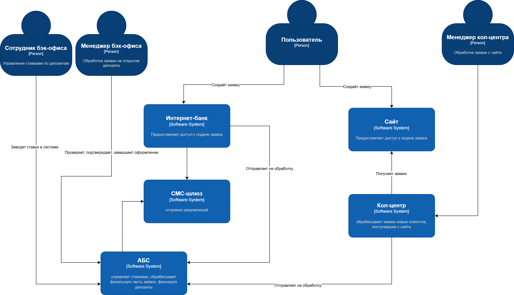
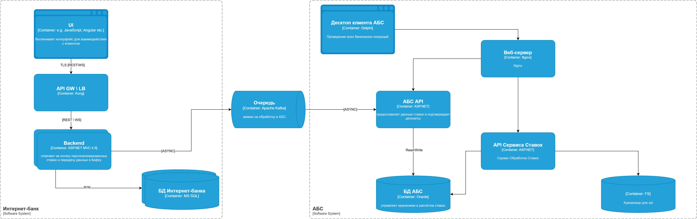

[на главную](../README.md) | [задание 4](../Exc4/README.md) | [задание 2](../Exc2/README.md)

---

# Задание 3

### **Название задачи:** Открытие депозитов (MVP)
### **Автор:** Абрамов Артур Олегович
### **Дата:** 05.03.2025
### **Функциональные требования**
Опишите здесь верхнеуровневые Use Cases. Их нужно оформить в виде таблицы с пошаговым описанием:

|**№**|**Действующие лица или системы**|**Use Case**|**Описание**|
| :-: | :- | :- | :- |
|1|Клиент|Подача заявки через интернет-банк|Клиент видит доступные ставки, выбирает депозит, указывает сумму и счёт, подтверждает заявку через СМС.|
|2|Клиент|Подача заявки через сайт|Новый клиент оставляет ФИО и номер телефона, после чего с ним связывается менеджер для уточнения данных.|
|3|Менеджер кол-центра|Обработка заявки с сайта|Менеджер связывается с клиентом, проверяет информацию и вводит данные в АБС для дальнейшего оформления.|
|4|Менеджер бэк-офиса|Обработка заявки на открытие депозита|Проверяет данные, подтверждает условия депозита, завершает оформление в АБС.|
|5|Бэк-офис|Управление ставками по депозитам|Сотрудники вводят ставки в единую систему управления (АБС), чтобы обеспечить доступность данных для всех.|

### **Нефункциональные требования**
Опишите здесь нефункциональные требования и архитектурно-значимые требования.

|**№**|**Требование**|
| :-: | :- |
|||
|1|Система должна быть доступна 24/7 с уровнем доступности 99,9%|
|2|Все данные клиента должны быть защищены через шифрование (TLS)|
|3|Время отклика интерфейса должно составлять менее 1 секунды|
|4|Использование существующих технологий (MS SQL, Oracle, Kafka)|
|5|Минимизация нагрузки на АБС через внедрение промежуточного слоя|
|6|Поддержка масштабируемости для увеличения количества запросов|

### **Решение**
Приведите диаграммы контекста и контейнеров в модели C4. Опишите там основные компоненты и интеграции всех элементов решения. 

Также опишите, какой логикой вы руководствовались в ходе принятия решений и выбора технологий. Не забывайте, что необходимо учесть все функциональные и нефункциональные требования.

Интернет-банк:
        UI: обеспечивает интерфейс для взаимодействия с клиентом.
        Backend: отвечает за логику персонализированных ставок и передачу данных в Кафку.
    Промежуточный слой:
        Kafka (по необходимости): обрабатывает очереди сообщений для асинхронной обработки данных.
АБС:
        База данных ставок: управляет хранением и расчётом ставок.
        API: предоставляет данные ставок и подтверждает депозиты.

[с4_контекст](./с4_context.drawio)

[c4_контейнеры](./c4_container.drawio)

*доработка диаграммы контейнеров*:

Из задания знаем, что ставки хранятся в xls документах. на диаграмме добалено некое файловое хранилище, где они будут лежать. Функциональность обработки ставок (некоторый мини etl-процесс над файлами со ставками и доставки данных в бд) выделен в сервис. Добавлен на диаграмму десктопное приложение AБС. Десктоп с api общается через nginx (он нам нужен сейчас как агрегатор апи). Данные о ставках грузятся в бд оракл.

### **Альтернативы**
Опишите здесь наиболее важные альтернативные решения.

Прямая интеграция интернет-банка с АБС:

Плюсы: упрощение архитектуры.

Минусы: высокая нагрузка на АБС, риски отказа всей системы.

Использование внешнего CRM для управления заявками:

Плюсы: специализированный интерфейс для кол-центра.

Минусы: дополнительные затраты на интеграцию и обучение.

**Недостатки, ограничения, риски**

Подробно опишите здесь недостатки, ограничения и риски выбранного решения.

Недостатки:
        Необходимость доработки существующих компонентов (например, интеграции СМС).
        Нагрузка на разработку промежуточного слоя.

Ограничения:
        Интернет-банк несовместим с Kafka; возможно временное использование альтернатив.

 Риски:
        Возможная перегрузка АБС при большом количестве заявок.
        Отсутствие экспертизы по новым технологиям в команде.

---

[на главную](../README.md) | [задание 4](../Exc4/README.md) | [задание 2](../Exc2/README.md)