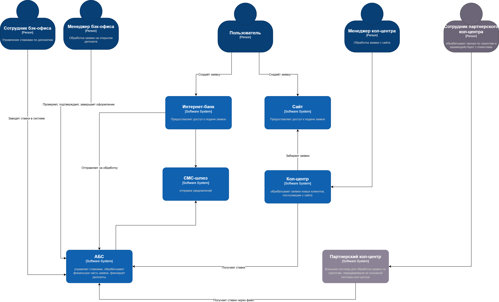
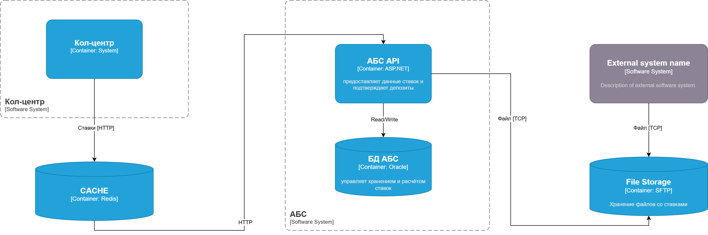
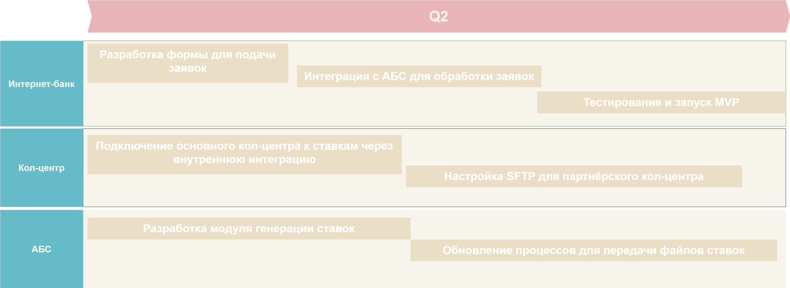
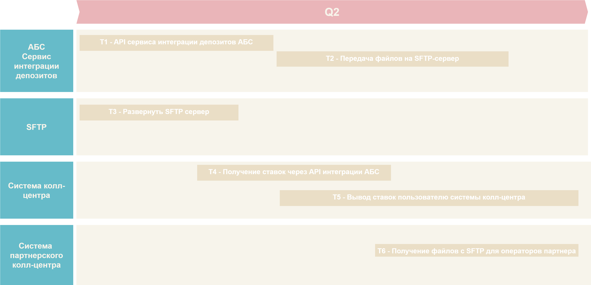

[на главную](../README.md) | [задание 3](../Exc3/README.md)

---

# Задание 4

## 4.1 ADR для новых изменений

### **Название задачи:** Название задачи: Создание MVP для автоматизации подачи заявки на депозит в интернет-банке и обеспечения передачи актуальных ставок для кол-центра и партнёрского кол-центра.
### **Автор:** Абрамов Артур Олегович
### **Дата:** 05.03.2025
### **Функциональные требования**
Опишите здесь верхнеуровневые Use Cases. Их нужно оформить в виде таблицы с пошаговым описанием:

|**№**|**Действующие лица или системы**|**Use Case**|**Описание**|
| :-: | :- | :- | :- |
|1|Клиент|Подача заявки на депозит в интернет-банке|Клиент заполняет форму для подачи заявки на депозит в интернет-банке.|
|2|Клиент заполняет форму для подачи заявки на депозит в интернет-банке|Консультация по ставкам в кол-центре|Сотрудник получает актуальные ставки по депозитам для консультации клиента.|
|3|Партнёрский кол-центр|Получение ставок партнёрским кол-центром|Система кол-центра получает актуальные ставки в формате файла|
|4|АБС|Обновление ставок|АБС предоставляет актуальные ставки через генерацию файла для передачи во внешние системы|
|5|IT-система партнёрского кол-центра|IT-система партнёрского кол-центра|Система партнёра обрабатывает файл и отображает ставки для своих сотрудников.|

### **Нефункциональные требования**
Опишите здесь нефункциональные требования и архитектурно-значимые требования.

|**№**|**Требование**|
| :-: | :- |
|||
|1|Актуальность данных: ставки должны обновляться не реже одного раза в сутки|
|2|Надёжность: процесс передачи данных должен быть устойчив к сбоям|
|3|Безопасность: данные о ставках должны быть переданы в зашифрованном виде|
|4|Совместимость: файл ставок должен быть в формате, понятном для системы партнёра|

### **Решение**

[с4_контекст](./rates__c4_context.drawio)

[c4_контейнеры](./rates__c4_containers.drawio)

### **Альтернативы**
Опишите здесь наиболее важные альтернативные решения.

1. Передача данных через API:

   1. Плюсы: высокая оперативность, лёгкость обновлений.
   2. Минусы: партнёрский кол-центр не поддерживает API, потребуется значительная доработка.

2. Передача данных через файлы (выбранное решение):

   1. Плюсы: совместимость с текущими процессами партнёрского кол-центра.
   2. Минусы: задержка в обновлении ставок (до 24 часов), риск ошибок при обработке файлов.

**Недостатки, ограничения, риски**

1. Зависимость от формата файлов:
   - Ограниченная гибкость при изменении структуры данных.

2. Риск ошибок в обработке файлов:
   - Партнёрский кол-центр может некорректно интерпретировать данные.

## 4.2 Cписок крупных задач для каждой системы из ADR для будущего планирования

### Интернет-банк
- Разработка формы подачи заявки на депозит.
- Интеграция интернет-банка с АБС для отправки заявок.
- Тестирование и запуск MVP с обработкой заявок через бэк-офис.

### АБС
- Разработка модуля генерации ставок для передачи данных.
- Настройка автоматической генерации файлов ставок в формате, совместимом с партнёрским кол-центром.
- Интеграция с интернет-банком для обработки заявок.
- Разработка автоматизированного процесса создания депозитов (для финального состояния через год).

### Кол-центр
- Интеграция кол-центра с системой ставок через внутренний API.
- Настройка интерфейсов для отображения ставок сотрудникам.

### Партнёрский кол-центр
- Разработка SFTP-интеграции для получения файлов ставок. 
- Настройка обработки файлов ставок в информационной системе партнёрского кол-центра. 
- Тестирование процесса передачи и обработки данных.

### Инфраструктура
- Настройка и тестирование SFTP-сервера для передачи файлов.

# 4.3 RoadMap 

[roadmap](./roadmap.drawio)

---

[на главную](../README.md) | [задание 3](../Exc3/README.md)